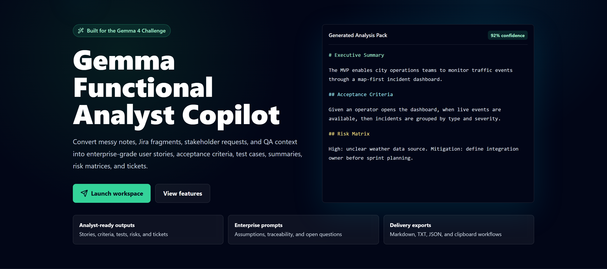
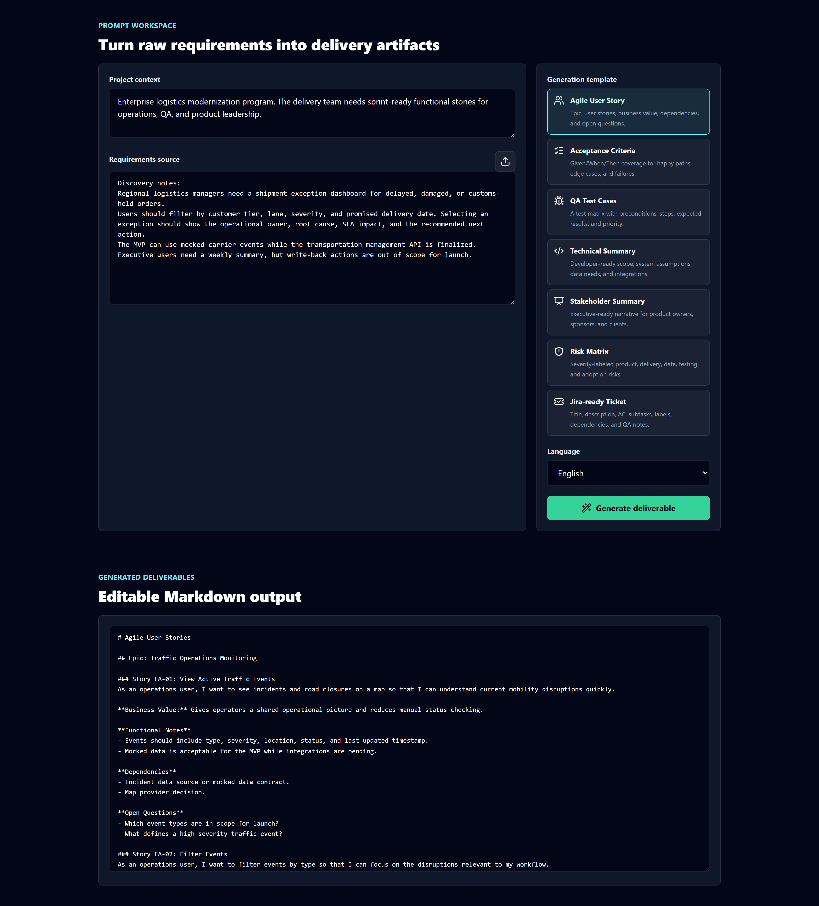
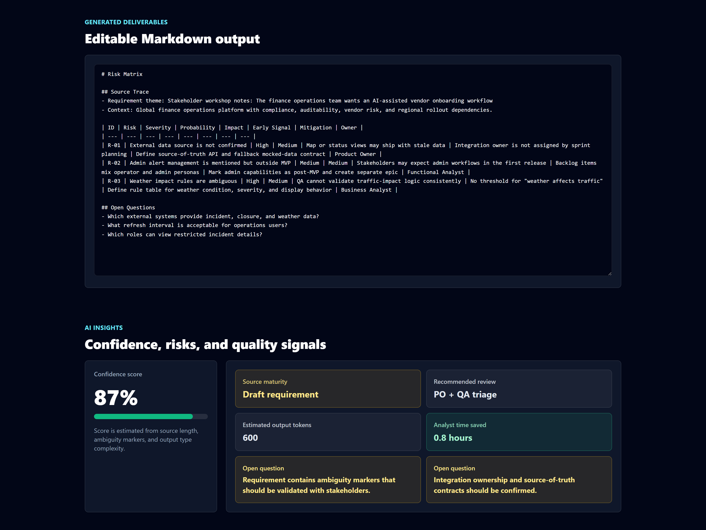
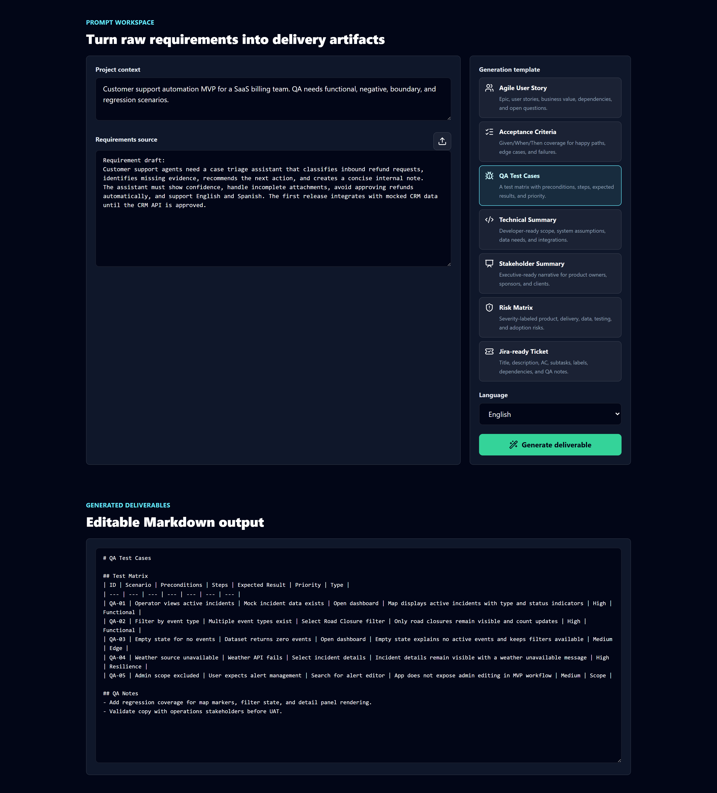

# Gemma Functional Analyst Copilot

AI-powered workspace for Functional Analysts, Business Analysts, QA Analysts, and Product Owners. It turns messy requirements into structured delivery artifacts using Google Gemma 4.

## Links

- GitHub: https://github.com/olcesefacundo97/gemma-functional-analyst-copilot
- Frontend Demo: https://gemma-functional-analyst-copilot.vercel.app
- Backend API: https://gemma-functional-analyst-copilot.onrender.com

## Overview

Functional analysis work often begins with rough meeting notes, incomplete Jira tickets, stakeholder comments, and scattered technical constraints. This MVP packages Gemma 4 into a focused product workflow that transforms that raw input into professional artifacts teams can review, test, and ship from.

## Features

- Paste requirements, meeting notes, or ticket fragments.
- Upload `.txt` and `.md` source files.
- Generate Agile user stories, acceptance criteria, QA test cases, technical summaries, stakeholder summaries, risk matrices, and Jira-ready tickets.
- Enterprise-style prompt engineering with assumptions, open questions, traceability, and delivery-ready formatting.
- Dashboard with fake but realistic analytics: documents processed, tokens generated, productivity gain, and estimated hours saved.
- Dark mode, responsive SaaS UI, loading states, toasts, empty states, and smooth interactions.
- Prompt history with local storage persistence.
- Editable generated output.
- Export to Markdown, TXT, JSON, or copy to clipboard.
- Backend abstraction that supports Google AI Studio or a local demo provider.

## Architecture

```text
React + Vite + TypeScript + TailwindCSS
        |
        | POST /analyze
        v
FastAPI + Pydantic
        |
        | Google AI Studio API
        v
Gemma 4
```

### Frontend

- `frontend/src/components` reusable UI sections.
- `frontend/src/services/api.ts` API client.
- `frontend/src/hooks/useLocalStorage.ts` local persistence.
- `frontend/src/data/templates.ts` generation templates and sample data.
- `frontend/src/utils/exporters.ts` report export helpers.

### Backend

- `backend/app/main.py` FastAPI routes, CORS, and response metadata.
- `backend/app/schemas.py` Pydantic request/response models.
- `backend/app/prompts.py` deliverable-specific prompt templates.
- `backend/app/gemma_client.py` Google AI Studio provider and demo fallback.

## Screenshots






## Setup

### Backend

```bash
cd backend
python -m venv .venv
.venv\Scripts\activate
pip install -r requirements.txt
copy .env.example .env
uvicorn app.main:app --reload --port 8000
```

For macOS/Linux, use `source .venv/bin/activate` instead of the Windows activation command.

### Frontend

```bash
cd frontend
npm install
copy .env.example .env
npm run dev
```

Open `http://localhost:5173`.

## Environment Variables

Backend:

```bash
AI_PROVIDER=google
GOOGLE_API_KEY=your_google_ai_studio_api_key_here
GEMMA_MODEL=gemma-4-26b-a4b-it
ALLOWED_ORIGINS=http://localhost:5173,http://127.0.0.1:5173
```

Frontend:

```bash
VITE_API_URL=http://localhost:8000
```

For local demos without an API key, set:

```bash
AI_PROVIDER=demo
```

## Deployment

### Vercel Frontend

1. Import the repository in Vercel.
2. Set the project root to the repository root.
3. Use the included `vercel.json`.
4. Add `VITE_API_URL` with the deployed Render backend URL.
5. Deploy.

### Render Backend

1. Create a new Blueprint or Web Service from `render.yaml`.
2. Add `GOOGLE_API_KEY`.
3. Set `ALLOWED_ORIGINS` to the Vercel production URL.
4. Deploy the FastAPI service.

## Why Gemma 4

Gemma 4 is used as the reasoning engine for a professional workflow, not as a generic chatbot. This use case benefits from strong instruction following, structured transformation, long-context requirement interpretation, and reliable generation of practical artifacts like tests, risks, and tickets.

The model is asked to:

- identify assumptions and open questions,
- preserve traceability to the source material,
- format outputs for real delivery teams,
- adapt tone for technical and executive audiences,
- produce consistent Markdown that can be exported or pasted into Jira and Confluence.

## Future Roadmap

- PDF and DOCX ingestion.
- Jira API export.
- Confluence page publishing.
- Project templates for fintech, healthtech, ecommerce, and public sector workflows.
- Organization-level prompt libraries.
- Evaluation harness for comparing Gemma model outputs.
- Role-based collaboration and review comments.
- Local Gemma endpoint support for private deployments.

## DEV Challenge Submission

This project was built for the DEV Community Gemma 4 Challenge as a portfolio-quality MVP for analysts and product delivery teams.

Suggested demo flow:

1. Open the landing page.
2. Scroll to the Prompt Workspace.
3. Use the sample traffic operations requirement or upload a Markdown file.
4. Generate a Jira-ready ticket or QA test matrix.
5. Show AI insights, confidence, open questions, and export options.

## License

MIT
